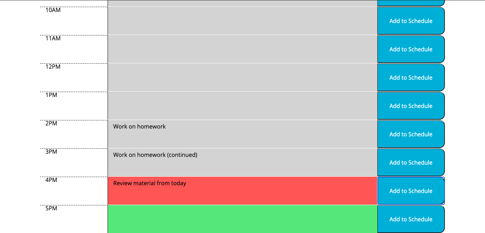

# Daily Sheduler

## Preface
Our work days can get pretty hectic, and maybe it's hard to keep track of what we're doing throughout the day. For this reason, it's often useful to use a Scheduler, or a Planner, to keep track of your tasks on a daily basis.

## Description
In comes the Work Day Scheduler site. This site allows you to jot down your tasks on a scheduler as needed. On top of the page, you'll see the current day, month, and year. There are nine table rows that keep track of every hour representative of that work day, from 9AM-5PM. Its colors of the input text area change depending on whether the specific hour has past (grey), is currently present (green), or has yet to happen (green). What's great, is that all of your tasks are saved even if you close the browser by accident or refresh the page, allowing you to keep track of your daily tasks no matter what.

## Methods
The new Date() constructer and its methods were used to get the current day of the week, the current month of the year, the day of that month, and the year. Since the getDay() method only returns a number (0-6), an array was created with the seven days inside of it. 0 represented Sunday, 1 represented Monday, etc. Similarly with the months, getMonth() returned a number (0-11). The same technique was used to retrieve the name of the month.

In order to compare the current time to the time assigned to each row, I created an arbitrary attribute called "time". Each HTML element containing a time block was assigned that attribute. The value inputted will represent the time in a 24 hour format. Example, if the timeblock displays 3PM, the attribute "time" will have a value of 15. Then the current hour is retrieved by using the new Date method getHours(). Finally, the time attribute is compared to the current hour. If it is less than the current hour, it'll assign the class "past" to the appropriate text area. If it is equal to current hour, the class "present" will be assigned. If it is greater than, then "future" is assigned.

Finally, event listeners were added to each individual button that would take in the input value of the given text area and save it in local storage. That same text area will retrieve the value inputted into local storage and keep the text displayed.